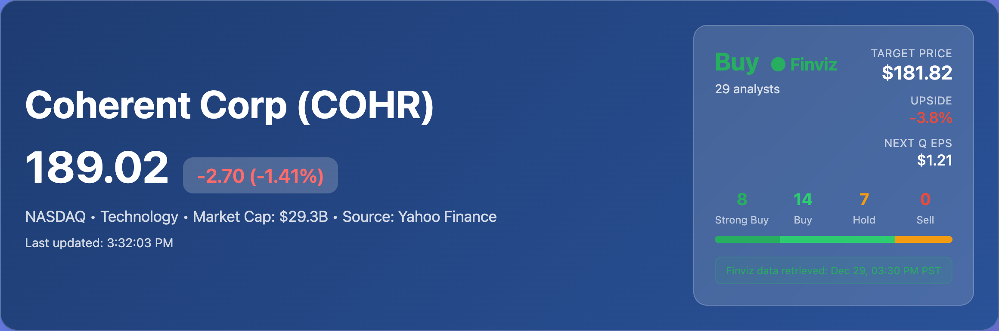
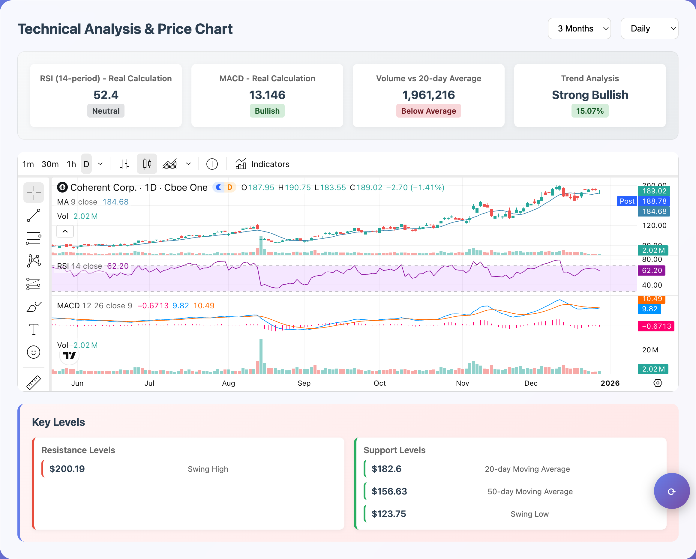
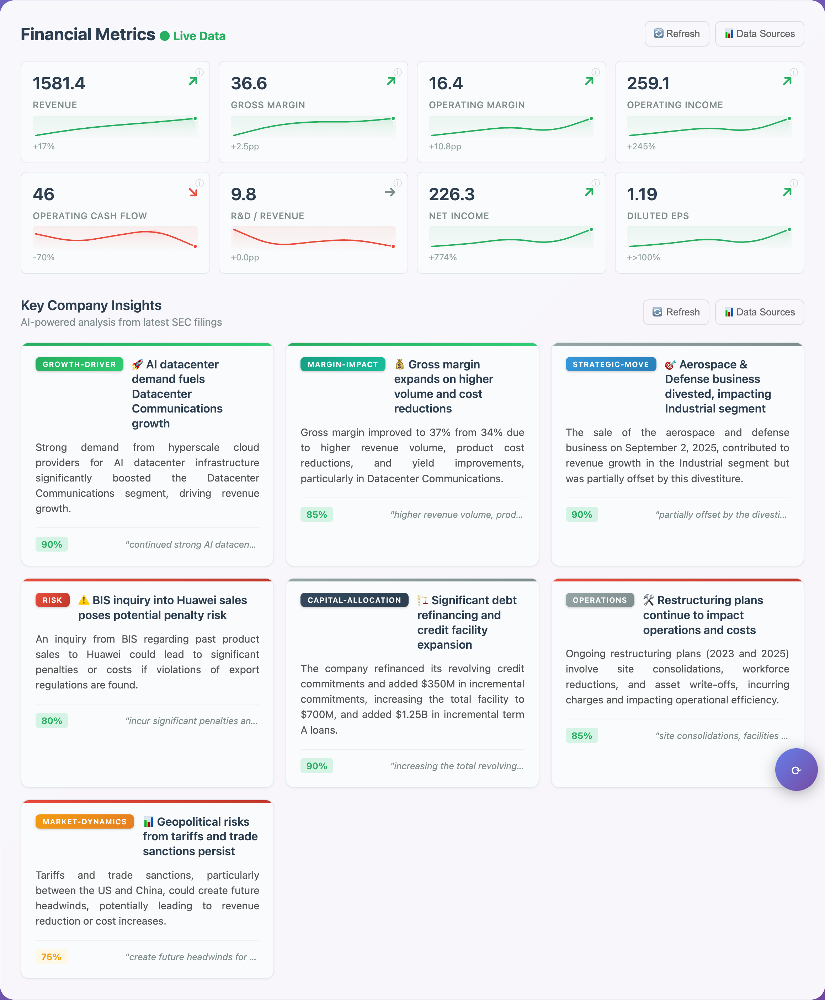
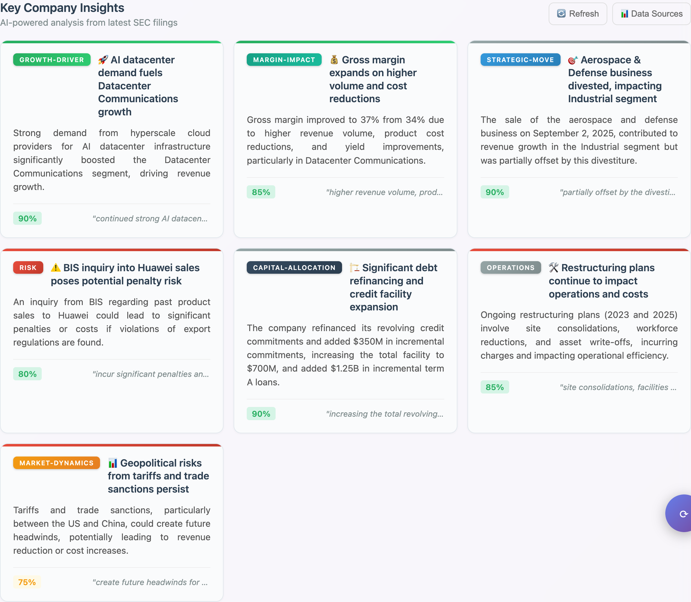
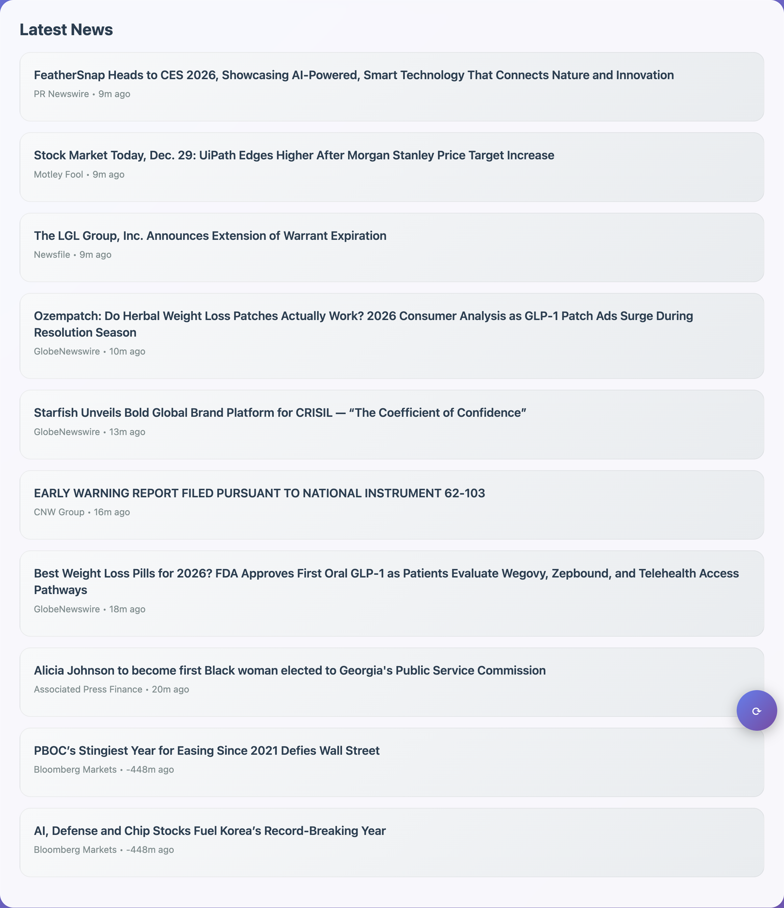

# COHR Investor Dashboard

**Status**: **LIVE & DEPLOYED**

A comprehensive, real-time investor dashboard for Coherent Corp (NASDAQ: COHR) featuring live stock data, real historical technical analysis, **LLM-powered SEC filing analysis**, and intelligent financial news. Built with Vercel serverless architecture and **Google Gemini 3 Flash** for professional-grade financial analysis with investment-focused insights.

## Live Dashboard

**Currently Deployed**: The dashboard is live and operational on Vercel
**Auto-Updates**: Stock data refreshes every 5 minutes
**Mobile Ready**: Responsive design works on all devices

## Screenshots

### Header & Stock Price
Real-time stock price with analyst consensus ratings from Finviz.



### Interactive Price Chart
TradingView widget with technical indicators (RSI, MACD, Volume) and key support/resistance levels.



### Financial Metrics
8 verified GAAP metrics extracted from SEC 10-Q filings using Gemini 3 Flash. Hover over any metric for explanation and calculation formula.



### AI-Powered Company Insights
Investment-grade analysis with 8 professional categories extracted from SEC filings.



### Latest News
COHR-specific financial news from Yahoo Finance with article summaries.



## Key Features

### **Financial Metrics with Real Sparklines** (NEW!)
- **8 Key Financial KPIs** with hover tooltips explaining each metric:
  - **Revenue** - Total revenues from all business segments
  - **Gross Margin** - `(Revenue - COGS) / Revenue x 100`
  - **Operating Margin** - `Operating Income / Revenue x 100`
  - **Operating Income** - EBIT from core operations
  - **Operating Cash Flow** - Cash from operations
  - **R&D / Revenue** - `R&D Expenses / Revenue x 100`
  - **Net Income** - Bottom-line profit
  - **Diluted EPS** - `Net Income / Diluted Shares`
- **100% Verified Accuracy** against official SEC filings:
  - Revenue: $1,581M
  - Gross Margin: 36.6%
  - Operating Margin: 16.4%
  - Operating Income: $259M
  - R&D/Revenue: 9.8% ($154.9M / $1,581.4M)
  - Net Income: $226M
  - Diluted EPS: $1.19
- **Real 8-quarter sparklines** from Redis-cached historical data
- **Metric tooltips** with formulas for calculated metrics
- **Color-coded trend indicators** for quick visual scanning

### **Professional Company Insights**
- **Investment-grade analysis** with 8 professional categories:
  - **GROWTH-DRIVER** - New revenue engines, secular tailwinds, market-share wins
  - **MARGIN-IMPACT** - Cost take-outs, mix shift, pricing power
  - **RISK** - Litigation, macro headwinds, regulatory changes
  - **STRATEGIC-MOVE** - M&A, divestitures, major hires
  - **CAPITAL-ALLOCATION** - Buybacks, dividends, debt management
  - **INNOVATION** - Patents, product launches, R&D milestones
  - **MARKET-DYNAMICS** - Industry demand shifts, competitor actions
  - **OPERATIONS** - Supply-chain issues, manufacturing yields
- **Color-coded confidence indicators** (high/medium/low)
- **Data Sources panel** showing extraction methodology

### **LIVE & REAL DATA**
- **Real-time Stock Prices** - Yahoo Finance chart API with intelligent fallbacks
- **Interactive Charts** - TradingView widget with professional technical overlays
- **Historical Technical Analysis** - Real support/resistance from swing highs/lows
- **LLM-Powered Business Intelligence** - Real Q1 FY2026 SEC filing analysis
  - **Google Gemini 3 Flash** extracts data from latest SEC filings
  - **Filing change detection** - Only reprocesses when new 10-Q detected
  - **Quarter-based caching** - Historical data persists permanently
- **Analyst Consensus** - Finviz primary source with multi-API fallback
  - Real-time price targets and EPS estimates
  - Query timestamps for data transparency

## Architecture

### **Tech Stack**
- **Frontend**: Static HTML5 + Vanilla JavaScript
- **Backend**: Vercel Serverless Functions (Node.js)
- **LLM**: Google Gemini 3 Flash Preview (`gemini-3-flash-preview`)
- **Caching**: Redis Cloud for persistent metrics/insights storage
- **Schema Validation**: Zod for robust data transformation
- **Deployment**: Vercel with GitHub integration
- **Charts**: TradingView widget

### **Project Structure**
```
/
├── index.html                    # Enhanced dashboard with real data
├── api/                          # Vercel serverless functions
│   ├── stock.js                 # Yahoo Finance real-time quotes
│   ├── news.js                  # Yahoo Finance news with summaries
│   ├── analyst.js               # Finviz analyst consensus
│   ├── technical-real.js        # Real historical technical analysis
│   ├── sec-filings.js           # SEC EDGAR filing fetcher
│   ├── universal-metrics.js     # GAAP metrics extraction
│   ├── company-insights.js      # Business intelligence extraction
│   └── sparkline-data.js        # Historical sparkline data
├── lib/                          # Technical analysis & LLM utilities
│   ├── geminiService.js         # Google Gemini 3 Flash LLM service
│   ├── cacheService.js          # Redis Cloud caching with filing detection
│   ├── metricsExtractor.js      # GAAP metrics extraction prompts
│   └── insightsExtractor.js     # Company insights extraction prompts
├── scripts/                      # Utility scripts
│   └── backfill-historical-metrics.js  # Historical 10-Q backfill
└── docs/                         # Documentation & screenshots
```

## API Endpoints

All endpoints include CORS support and 30-second timeout limits:

- **`GET /api/stock?symbol=COHR`** - Live stock price, change, market cap
- **`GET /api/news?symbol=COHR&limit=10`** - COHR-specific financial news
- **`GET /api/analyst?symbol=COHR`** - Analyst consensus and price targets
- **`GET /api/universal-metrics?symbol=COHR`** - GAAP financial metrics
- **`GET /api/company-insights?symbol=COHR`** - Business intelligence
- **`GET /api/sparkline-data?symbol=COHR`** - 8-quarter historical data

### **Filing Change Detection**
The system automatically detects new SEC 10-Q filings:
1. Fetches latest filing metadata from SEC EDGAR
2. Compares accession number with last processed filing
3. Only triggers LLM reprocessing when new filing detected
4. Caches results by quarter for permanent storage

## Quick Deployment

### **For Users**
1. Visit the live dashboard URL
2. No setup required - all data loads automatically
3. Hover over metrics for explanations

### **For Developers**
```bash
# Clone Repository
git clone https://github.com/seaberger/cohr_dashboard.git
cd cohr_dashboard

# Install dependencies
npm install

# Create .env.local with API keys
GEMINI_API_KEY=your_key_here     # Google Gemini API
REDIS_URL=redis://...             # Redis Cloud URL

# Start development server
npm run dev
```

## Data Quality & Sources

### **Verified Metrics Accuracy**
All metrics verified against [Coherent Q1 FY2026 Earnings Release](https://www.globenewswire.com/news-release/2025/11/05/3181974/11543/en/Coherent-Corp-Reports-First-Quarter-Fiscal-2026-Results.html):

| Metric | Extracted | Official | Status |
|--------|-----------|----------|--------|
| Revenue | $1,581M | $1,581.4M | Verified |
| Gross Margin | 36.6% | 36.6% | Verified |
| Operating Margin | 16.4% | 16.4% | Verified |
| Operating Income | $259M | $259.1M | Verified |
| R&D/Revenue | 9.8% | 9.8% | Verified |
| Net Income | $226M | $226.3M | Verified |
| Diluted EPS | $1.19 | $1.19 | Verified |

### **LLM Integration**
- **Model**: Google Gemini 3 Flash Preview (`gemini-3-flash-preview`)
- **Source**: SEC EDGAR 10-Q filings
- **Caching**: Redis Cloud with quarter-based keys
- **Filing Detection**: Automatic new filing detection by accession number
- **Cost**: <$1/month with smart caching

## Development Roadmap

### **COMPLETED**
- Real-time stock data with multi-source fallbacks
- TradingView interactive charts
- Real historical technical analysis
- LLM-powered SEC filing analysis
- 8 GAAP financial metrics with tooltips
- Real 8-quarter sparklines from Redis cache
- Investment-grade company insights
- Filing change detection system
- Gemini 3 Flash upgrade (100% accuracy verified)
- Metric tooltips with calculation formulas

### **NEXT PRIORITIES**
- Performance optimization
- Enhanced loading states
- Advanced export features
- Competitive intelligence section

## Security & Privacy

- **API Keys**: Environment variables only
- **HTTPS**: Enforced by Vercel
- **No Personal Data**: No user tracking

---

**Investment Disclaimer**: This dashboard is for informational purposes only. Not financial advice.

**Repository**: [github.com/seaberger/cohr_dashboard](https://github.com/seaberger/cohr_dashboard)
